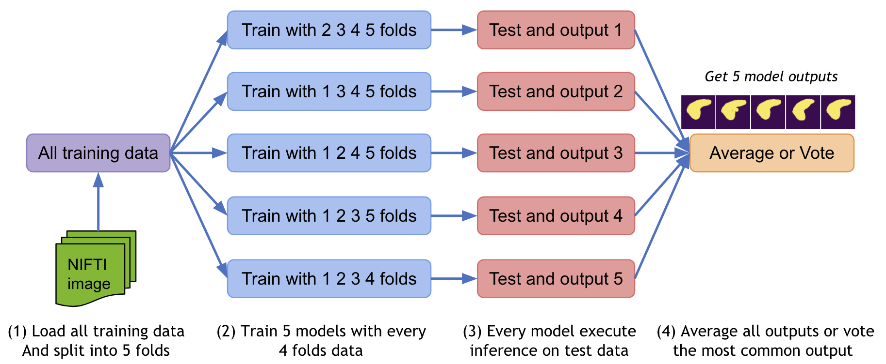

# Ensemble Segmentation
(https://github.com/Project-MONAI/MONAI)
The toolbox is used to train segmentation algorithms with ensemble method, when a limited number of data are available and cross-validation must be performed
*******************************************************************************
## Requirements
We download the official MONAI DockerHub, with the latest MONAI version. Please visit https://docs.monai.io/en/latest/installation.html
*******************************************************************************
## Python scripts and their function

- organize_folder_structure.py: Organize the data in the folder structure for the network (for training and inference). Two folders are created: images and labels with nifti files.

- init.py: List of options used to train the network. Check the description to set you preferred parameters.

- check_loader_patches: Shows example of patches fed to the network during the training. You can used to test the augmentations and look at the images.

- train.py: Runs the training.

- predict_single_image.py: It launches the inference on a single input image chosen by the user.
*******************************************************************************
## Usage
### Folders structure:
Use first "organize_folder_structure.py" to create organize the data in the following folder structure:

	.
	├── Data_folder                   
	|   ├── images              
	|   |   ├── image1.nii              
	|   |   └── image2.nii                     
	|   ├── labels                    
    |   |   ├── label1.nii              
	|   |   └── label2.nii                     

*******************************************************************************
### Training:
Modify the "init.py" to set the parameters and start the training/testing on the data.

*******************************************************************************
### Inference:
Launch "predict_single_image.py" to test the network. The average-ensemble model is used. Modify the parameters in the parse section to select the path of the weights, images to infer and result. 
*******************************************************************************
### Tips:
- Use and modify "check_loader_patches.py" to check the patches fed during training. 
- The Network is th nn-Unet implemented in MONAI: it adapts automatically to the resoultion of the image and patch size selected. 
- It supports multi-channels inputs, but you must add some line of code in the "transforms" section in the training: a channel must be added and then a concatenation must be performed.
  Look at the Monai tutorials for more details 
*******************************************************************************
### Warnings:

- Monai's ensemble supports only single-gpu for now: the input size of the patches can't be to large to not slow down the training process. If the multi-gpu will be developed, this version will be updated as well.

